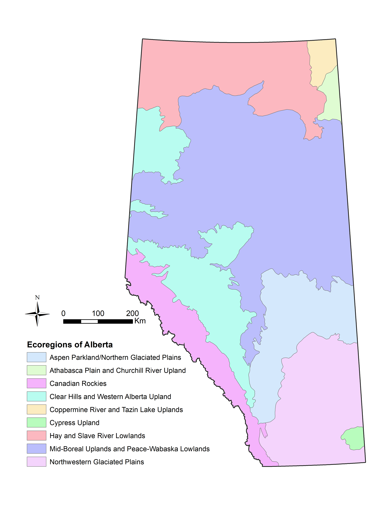

***

# Summary

There is interest in including a provincial layer demarcating important climate change refugia, or areas of species persistence under climate change, in the Biodiversity Data Query Tool (BDQT). Stralberg (2019) has used the concept of **climate velocity** - the speed at which organisms must migrate to keep pace with climate change - to identify  areas of high potential refugium value for a given time period (e.g. 2050s or 2080s) and species or ecoregion (Stralberg, 2018a). In the case of ecoregion, refugia represent areas where the particular climatic conditions of that ecoregion may persist into the future. From a conservation perspective, a layer representing ecoregion refugia value under future climate change pathways and timeframes would help managers prioritize areas that are more likely to provide species with conditions that allow them to persist into the future.

***

```{r include=TRUE, echo=FALSE, message=FALSE, warning=FALSE, eval=TRUE}

# Load packages
library(raster)
library(sf)
library(leaflet)
library(htmlwidgets)
library(leaflet.extras)
library(tidyverse)
library(knitr)

# Import data

# Alberta shapefile
ab_prov <- st_read("./data/base/ab_prov.shp", quiet = TRUE, stringsAsFactors = FALSE)

# Ecoregion 98 (Mid-Boreal Uplands and Peace-Wabaska Lowlands) - as an example.
eco98_curr <- raster("./data/processed/eco98_curr1.tif")
eco98_45_2050 <- raster("./data/processed/eco98_45_20501.tif")
eco98_45_2080 <- raster("./data/processed/eco98_45_20801.tif")

# Max Refugia values
mr_45_2050 <- raster("./data/processed/mr_45_2050_ab.tif") # RCP 4.5
mr_45_2080 <- raster("./data/processed/mr_45_2080_ab.tif") # RCP 4.5
mr_85_2050 <- raster("./data/processed/mr_85_2050_ab.tif") # RCP 8.5
mr_85_2080 <- raster("./data/processed/mr_85_2080_ab.tif") # RCP 8.5

```

## Calculating Refugia Scores

Analysis was conducted at the Level III ecoregion scale [(US EPA)](https://www.epa.gov/eco-research/ecoregions-north-america), of which there are 182 across North America, and 9 that intersect Alberta (Figure 1 below).

```{r include=TRUE, echo=FALSE, message=FALSE, warning=FALSE, eval=TRUE, out.width="70%", fig.align="center", fig.cap="Figure 1. Ecoregions in Alberta."}



```
<br>

For two future time periods (2050s and 2080s) and two representative concentration pathways (RCP 4.5 and RCP 8.5), an index score of refugia value was calculated - i.e., a score indicating areas of climatic similiarity to that present-day ecoregion. Index scores ranges from 0 to 1, with higher scores representing areas with the potential for greater similarity. The calculations are based on the average of projections from 10 different global climate models. 

**For example, displayed below is the current extent of an example ecoregion in the province, the Mid-Boreal Uplands and Peace-Wabaska Lowlands**. You can toggle to two different layers to display the spatial extent of predicted climate refugia for this ecoregion in the province in each of the 2050s and 2080s timeframes (both are calculated using the 4.5 RCP). Interpretation-wise, this means that pixels with higher scores (blue) are more likely to represent areas where the climates of this ecoregion will persist into the future.   

<br>
<br>
```{r include=TRUE, echo=FALSE, message=FALSE, warning=FALSE, eval=TRUE, out.width="100%", fig.height=9, fig.cap="Figure 2. Current Extent and Future Refugia Values for the Mid-Boreal Uplands and Peace-Wabaska Lowlands in Alberta, using Representative Concentration Pathway 4.5."}

eco98_45_2050[eco98_45_2050 == 0] <- NA
eco98_45_2080[eco98_45_2080 == 0] <- NA

pal1 <- colorNumeric("YlGnBu", 
                     domain = c(minValue(eco98_45_2050), maxValue(eco98_45_2080)), 
                     na.color = "transparent")

map_98 <- ab_prov %>%
  st_transform("+init=epsg:4326") %>%
  leaflet() %>%
  addTiles() %>%
  addProviderTiles("Stamen.TerrainBackground") %>%
  addFullscreenControl() %>%
  addResetMapButton() %>%
  addScaleBar(position = "bottomleft",
              options = scaleBarOptions(imperial = FALSE)) %>%
  
  # Add provincial polygon
  addPolylines(color = "#0a0909", weight = 2, smoothFactor = 0.2, 
               opacity = 3.0, fill = FALSE) %>%

  # Add raster layers
  addRasterImage(eco98_curr, colors = "grey80", opacity = 1, group = "Current Extent") %>%
  addRasterImage(eco98_45_2050, colors = pal1, opacity = 1, group = "RCP 4.5 - 2050s") %>%
  addRasterImage(eco98_45_2080, colors = pal1, opacity = 1, group = "RCP 4.5 - 2080s") %>%
  
  # Add legend
  addLegend(pal = pal1, values = values(eco98_45_2050), opacity = 1,  
            title = "Refugia Index Value", position = "bottomright") %>%
  
  # Layers Control
  addLayersControl(baseGroups = c("Current Extent",
                                  "RCP 4.5 - 2050s",
                                  "RCP 4.5 - 2080s"),
                   options = layersControlOptions(collapsed = FALSE)) %>%
  
  hideGroup(c("RCP 4.5 - 2050s", 
              "RCP 4.5 - 2080s"))

map_98

```
<br>
<br>

## Maximum Ecoregional Refugia Values

To stitch together a cohesive wall-to-wall layer, we can retrieve for each 1km$^2$ pixel the *maximum* ecoregional refugia layer score it receives across individual ecoregion assessments.  
<br>

Per D.Stralberg,

> Because the refugia index goes rapidly to zero outside of a given ecoregion, there is very little overlap among refugia values for individual ecoregions. To display refugia potential across ecoregions, I took the maximum value at any given pixel. i.e., a given pixel was assigned a value based on the ecoregion for which it had the highest refugia potential. In the majority of cases this was the ecoregion in which the pixel is currently found. However, in many instances, a border pixel had a greater chance of serving as a refugium for a nearby ecoregion type than retaining the climate conditions of its current ecoregion.

The resulting raster layers are displayed below in Figure 3, at each of the different RCP's and future timeframes. 

<br>
<br>
```{r include=TRUE, echo=FALSE, message=FALSE, warning=FALSE, eval=TRUE, out.width="100%", fig.height=9, fig.cap="Figure 3. Maximum Ecoregional Refugia Values for both the 4.5 and 8.5 RCPs into two time periods: 2050s and 2080s."}

pal2 <- colorNumeric("YlGnBu", domain = c(minValue(mr_85_2080), maxValue(mr_45_2050)), na.color = "transparent")

map_max <-
  leaflet() %>%
  addTiles() %>%
  addProviderTiles("Stamen.TerrainBackground") %>%
  addFullscreenControl() %>%
  addResetMapButton() %>%
  addScaleBar(position = "bottomleft",
              options = scaleBarOptions(imperial = FALSE)) %>%
  
  # Raster Layers
  addRasterImage(mr_45_2050, colors = pal2, opacity = 1, group = "RCP 4.5 - 2050s") %>%
  addRasterImage(mr_45_2080, colors = pal2, opacity = 1, group = "RCP 4.5 - 2080s") %>%
  
  addRasterImage(mr_85_2050, colors = pal2, opacity = 1, group = "RCP 8.5 - 2050s") %>%
  addRasterImage(mr_85_2080, colors = pal2, opacity = 1, group = "RCP 8.5 - 2080s") %>%
  
  addLegend(pal = pal2, values = values(mr_45_2050), opacity = 1, 
            title = "Maximum Refugia Value", position = "bottomright") %>%
  
  # Layers Control
  addLayersControl(baseGroups = c("RCP 4.5 - 2050s",
                                  "RCP 4.5 - 2080s",
                                  "RCP 8.5 - 2050s",
                                  "RCP 8.5 - 2080s"),
                   options = layersControlOptions(collapsed = FALSE)) %>%
  hideGroup(c("RCP 4.5 - 2080s",
              "RCP 8.5 - 2050s",
              "RCP 8.5 - 2080s"))

map_max

```
<br>
<br>

## Considerations for a BDQT Layer

* Do we want to display the maximum refugia value layer (which doesn't give the user information about *which* ecoregion is being represented), or have options to view projected climate refugia for an ecoregion of interest? (one of the nine in the province). 
    + I could easily pull out the top 2/5/or 10% refugia values in the province for each ecoregion if we wanted to go the latter route; however, I like the simplicity of the single maximum layer as well.
<br>
<br>
* Diana has available a layer for boreal passerine birds (4-km$^2$ resolution) and North American birds & trees (10-km$^2$), too (Stralberg, 2018b). Would including one or both of these add value beyond the ecoregion analysis? I like the ecoregion layers because i) improved spatial resolution and ii) as a catch-all for taxa beyond birds and trees.

* Picking a timeframe and RCP scenario: earlier (2050s) makes more sense to me as being relevant from a management perspective, and I don't know what would be best re:RCP pathway.  
<br>

## References

Stralberg, D., C. Carroll, J. H. Pedlar, C. B. Wilsey, D. W. McKenney, and S. E. Nielsen. 2018a. Macrorefugia for North American trees and songbirds: Climatic limiting factors and multi-scale topographic influences. Global Ecology and Biogeography 27:690-703. https://doi.org/10.1111/geb.12731. 

Stralberg, D. Velocity-based macrorefugia for boreal passerine birds. Boreal Avian Modelling Project. Edmonton, Alberta, Canada. DOI: 10.5281/zenodo.1299880. https://doi.org/10.5281/zenodo.1299880.

Stralberg, Diana. 2019. Velocity-based macrorefugia for North American ecoregions [Data set]. Zenodo. http://doi.org/10.5281/zenodo.2579337.

<br>
<br>
<br>


